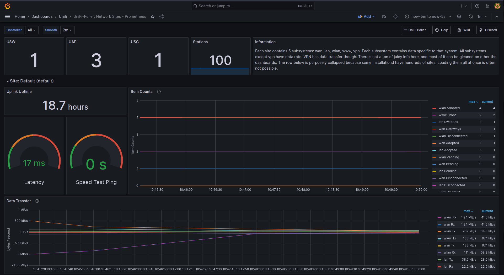

# Unifi poller

UniFi Poller allows you to collect data from your UniFi network controller, save
it to a database, and then display it on pre-supplied attractive and data-rich
Grafana dashboards.

## Global variables

Globally defined variables used by this deployment.

| Name                    | Documentation                                                                                  |
| ----------------------- | ---------------------------------------------------------------------------------------------- |
| docker_backend_network  | [Docker daemon](roles/docker_daemon.md)                                                        |
| docker_data_path        | [Docker daemon](roles/docker_daemon.md)                                                        |
| docker_frontend_network | [Docker daemon](roles/docker_daemon.md)                                                        |
| docker_group            | [Docker daemon](roles/docker_daemon.md)                                                        |
| docker_uid              | [Docker daemon](roles/docker_daemon.md)                                                        |
| inventory_hostname      | [Ansible](https://docs.ansible.com/ansible/latest/reference_appendices/special_variables.html) |
| mariadb_version         | [MariaDB](roles/docker_container/mariadb.md)                                                   |
| prometheus_enabled      | [Docker container](roles/docker_container.md)                                                  |
| smtp_from               | [Docker container](roles/docker_container.md)                                                  |
| smtp_host               | [Docker container](roles/docker_container.md)                                                  |
| smtp_password           | [Docker container](roles/docker_container.md)                                                  |
| smtp_user               | [Docker container](roles/docker_container.md)                                                  |
| ssl_enabled             | [Docker container](roles/docker_container.md)                                                  |
| timezone                | [Base](roles/base.md)                                                                          |

## Variables

| name                    | purpose                                       | default value | remark                                 |
| ----------------------- | --------------------------------------------- | ------------- | -------------------------------------- |
| unpoller_controller_url | The url on which the unifi controller listens |               |                                        |
| unpoller_ro_user        | The user used to connect to the controller    |               | Recommended to create a read only user |
| unpoller_version        | The version of the unpoller container         | latest        |                                        |
